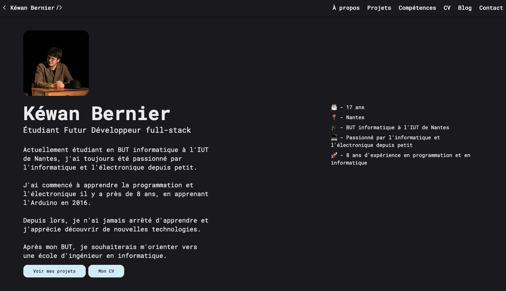

# [https://www.kewan.fr](https://www.kewan.fr)

Ce projet est mon site / portfolio personnel. J'y partage ma présentation, mes compétences, mon CV ainsi que mes projets personnels.
Je l'ai entièrement développé en HTML / CSS / JS, avec du Tailwind CSS pour faciliter le CSS, ainsi que du PHP pour les informations et le formulaire de contact.

## Présentation

Je m'apelle Kéwan Bernier.
Actuellement étudiant en BUT informatique à l'IUT de Nantes, j'ai toujours été passionné par l'informatique et l'électronique depuis petit.

J'ai commencé à apprendre la programmation et l'électronique il y a près de 8 ans, en apprenant l'Arduino en 2016.

Depuis lors, je n'ai jamais arrêté d'apprendre et j'apprécie découvrir de nouvelles technologies.

Après mon BUT, je souhaiterais m'orienter vers une école d'ingénieur en informatique.

## Mes Compétences

- **Langages de programmation** : Python, JavaScript, Arduino/C++, PHP, HTML, CSS, SQL, Golang
- **Frameworks** : Tailwind CSS, Vue.js, React.js, Express.js, 
- **Outils** : Git, Docker, Linux, VS Code, 
- **Langues** : Français (langue maternelle), Anglais (C1), Italien (B1)
